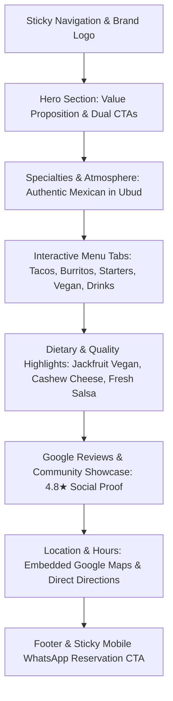

# Cilantro Ubud - Restaurant Landing Page Specification

> **Path**: `docs/features/001_cilantro_ubud_website_spec.md`  
> **Target Files**: `/index.html`, `/tests/landing.spec.js`, `assets/images/cilantro-logo.jpg`  
> **Status**: APPROVED_PLANNING

---

## 5W1H Requirements Summary

- **Who**: Tourists, digital nomads, locals, and food enthusiasts in Ubud, Bali looking for authentic Mexican food, vegan options, fresh margaritas, and a vibrant dining atmosphere.
- **What**: A conversion-optimized, responsive, zero-build single-page website for **Cilantro Ubud Mexican Restaurant & Bar**.
- **Where**: Single-page application in `/index.html` with assets in `/assets/images/` and tests in `/tests/landing.spec.js`.
- **When**: Immediate execution upon user approval of this feature plan.
- **Why**: Provide visitors with fast menu discovery, authentic Google review proof, opening hours, one-click WhatsApp reservations, and seamless Google Maps navigation.
- **How**: Semantic HTML5, Tailwind CSS via CDN, Alpine.js reactive menu tabs & mobile drawer, responsive Google Maps embed, and WhatsApp Click-to-Chat CTA.

---

## Architecture & Visual Hierarchy Overview



### Visual Layout
```text
+------------------------------------------------------------------+
| [Cilantro Logo]     Menu   About   Reviews   Location  [Book Table] |
+------------------------------------------------------------------+
| HERO: Authentic Mexican Fiesta in Ubud                           |
| Fresh Tacos, Chilled Margaritas & Vegan-Friendly Specials        |
| [Reserve via WhatsApp]               [Explore Our Menu]          |
| ⭐ 4.8 / 5 on Google Reviews (500+ Verified Diners)              |
+------------------------------------------------------------------+
| ABOUT & VIBE: Warm Bali Hospitality meets Vibrant Mexican Flare  |
+------------------------------------------------------------------+
| INTERACTIVE MENU TABS:                                           |
| [Tacos & Burritos] [Starters & Fajitas] [Vegan Magic] [Cocktails]|
| +-----------------+ +-----------------+ +-----------------+      |
| | Beef Wet Burrito| | Jackfruit Carni | | Jalapeño Popper |      |
| | IDR 85k         | | IDR 75k [🌱 VG] | | IDR 55k [🌶️ Hot] |      |
| +-----------------+ +-----------------+ +-----------------+      |
+------------------------------------------------------------------+
| GOOGLE REVIEWS & SOCIAL COMMUNITY                                |
| Real quotes from Google Maps + Instagram & Facebook links        |
+------------------------------------------------------------------+
| LOCATION & OPENING HOURS                                         |
| Open Daily 11:00 AM - 11:00 PM | Jl. Sugriwa, Ubud, Bali         |
| [Responsive Google Maps Iframe Embed + Direct Route Link]        |
+------------------------------------------------------------------+
| FOOTER & FLOATING WHATSAPP BUTTON (Bottom Right on Mobile)       |
+------------------------------------------------------------------+
```

---

## 1. Landing Page Section Details

### 1.1 Header & Navigation
- **File**: `/index.html`
- **Branding**: Logo image (`assets/images/cilantro-logo.jpg`) with stylized sombrero.
- **Navigation Links**: Anchor scrolling to `#menu`, `#about`, `#reviews`, `#location`.
- **CTA**: Direct WhatsApp Table Reservation button (`wa.me` with prefilled context: `"Halo Cilantro Ubud, I would like to reserve a table for [Date/Time/Guests]"`).
- **Mobile Menu**: Responsive slide-down drawer powered by Alpine.js (`x-data="{ mobileMenuOpen: false }"`).

### 1.2 Hero Section
- **Headline**: *"Vibrant Mexican Flavors in the Heart of Ubud"*
- **Subheadline**: Savor authentic tacos, sizzling fajitas, homemade guacamole, vegan jackfruit specialties, and handcrafted margaritas.
- **Primary CTAs**:
  - `Book a Table via WhatsApp` (high-contrast emerald/amber CTA button)
  - `View Menu` (smooth scroll anchor to `#menu`)
- **Trust Badge**: 4.8★ rating on Google Reviews with direct external link.

### 1.3 Interactive Menu Explorer
- **Section**: `<section id="menu">`
- **Alpine.js State**: `x-data="{ activeCategory: 'tacos' }"`
- **Categories**:
  1. **Tacos & Burritos**: Crispy & soft shell tacos, Wet Burritos, Burrito Bowls (Beef, Chicken, Fish, Pork).
  2. **Starters & Fajitas**: Jalapeño Poppers, Fresh Guacamole with House Corn Chips, Loaded Wedges, Sizzling Fajitas.
  3. **Vegan & Healthy**: Jackfruit Carnitas Tacos, Vegan Quesadillas with Cashew Cheese, Fresh Nacho Salad.
  4. **Drinks & Cocktails**: Classic & Frozen Margaritas, Cold Bintang, Healthy Fresh Juices, Tropical Smoothies.
- **Badges**: `🌱 Vegan`, `🌶️ Spicy`, `⭐ House Favorite`, `🌾 Gluten-Free Option`.

### 1.4 About & Atmosphere
- **Section**: `<section id="about">`
- Highlighting homemade tortillas, freshly made salsas daily, warm casual Ubud outdoor dining vibe, and dietary inclusivity (vegan/vegetarian friendly).

### 1.5 Google Reviews & Social Community
- **Section**: `<section id="reviews">`
- Verified reviewer testimonials highlighting great service, best tacos in Ubud, and vegan options.
- Direct links to **Google Reviews**, **Instagram** (`@cilantroubud`), and **Facebook** (`@cilantroubud8`).

### 1.6 Location, Hours & Google Maps
- **Section**: `<section id="location">`
- **Address**: Ubud, Gianyar, Bali (Jl. Sugriwa / Hanoman area).
- **Hours**: Monday – Sunday: 11:00 AM – 11:00 PM.
- **Interactive Map**: Responsive iframe wrapper with `aspect-video rounded-2xl overflow-hidden shadow-xl`.
- **Direct Link**: *"Get Directions on Google Maps"*.

### 1.7 Sticky Mobile Floating CTA & Modal
- Floating WhatsApp widget at bottom right on mobile screens.
- Reservation modal powered by Alpine.js (`x-data="{ modalOpen: false }"`).

---

## 2. Verification & Automated Test Plan

### 2.1 Test Suite Updates (`/tests/landing.spec.js`)
- [ ] Verify logo image path `/assets/images/cilantro-logo.jpg` exists and is referenced in `/index.html`.
- [ ] Verify all semantic landmarks (`<header>`, `<main>`, `<section id="menu">`, `<section id="about">`, `<section id="reviews">`, `<section id="location">`, `<footer>`).
- [ ] Verify WhatsApp CTA links contain valid `wa.me` links with URL encoded reservation text.
- [ ] Verify Google Maps iframe embed contains Ubud location coordinates.
- [ ] Verify Alpine.js state hooks (`mobileMenuOpen`, `activeCategory`, `modalOpen`).
- [ ] Verify social links for Instagram and Facebook.

### 2.2 Execution Command
```bash
npm test
```

---

## 3. Epic & Vibe Coding Estimation ⏱️

| Task ID | Component & Description | Vibe Coding (Dev) | Automated Testing | QA & Review | Total Est. Time | Priority |
| :--- | :--- | :---: | :---: | :---: | :---: | :--- |
| **T-001** | Brand setup, Logo asset integration & Header navigation | 20m | 10m | 5m | **35m (0.6h)** | Must Have |
| **T-002** | Hero section with Ubud value proposition & Trust badge | 15m | 10m | 5m | **30m (0.5h)** | Must Have |
| **T-003** | Interactive Alpine.js Menu Explorer with 4 categories & badges | 35m | 15m | 10m | **60m (1.0h)** | Must Have |
| **T-004** | About & Ubud vibe storytelling section | 15m | 5m | 5m | **25m (0.4h)** | Must Have |
| **T-005** | Google Reviews & Social Media integration (FB/IG) | 20m | 10m | 5m | **35m (0.6h)** | Must Have |
| **T-006** | Location, Opening Hours & Responsive Google Maps embed | 15m | 10m | 5m | **30m (0.5h)** | Must Have |
| **T-007** | Sticky Mobile WhatsApp reservation CTA & Quick Reservation Modal | 20m | 10m | 5m | **35m (0.6h)** | Must Have |
| **T-008** | Automated Node.js test suite suite execution (`npm test`) | 10m | 15m | 5m | **30m (0.5h)** | Must Have |
